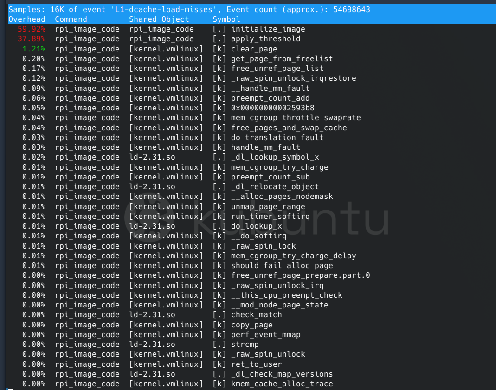

# Perf and PMU
 - A walkthrough on PMU and it's usabilty by leveraging Perf.

## Introduction

### What is the motivation?

I wanna get the cpu metrics in real time. Understanding CPU and getting insights about CPU during run time regarding various metrics and it's usage upon certain application is a important form of knowledge to optimize the system for that specific target.

I was curious know to is there any specific feature in modern processor to track the CPU metrics during run time without much overhead. This leads to the exploration of PMU (Performance Monitoring Unit), which is a sub system (bunch of hardware counters) use to monitor number of CPU events. So then my next question is, how can I enable and use it? One way would be accessing the PMU hardware directly using system control coprocessor instructions. Since the target is running on Linux platform I was pretty sure that there might be some drivers already exist to leverage this hardware functionality. Hence, there is Linux PMU driver exist and it offers numerous *Syscall* to access the PMU functionality. https://web.eece.maine.edu/~vweaver/projects/perf_events/perf_event_open.html

**Perf**, is a another command line tool in Linux which actually uses PMU under the hood to get the CPU metrics. PMU is supported in various platforms such as x_86, Arm and so on.
More about perf tool needs to added
Perf offers various sub commands to collect information about wide collections of hardware events using PMU. As per the ArmV8-A architecuture, the PMU can record more than XXX number of events. However, the number of hardware counters are limited and thereby if we need to record events more than the number of hardware counters then the system does multiplexing.

### PMU

The basic blocks of PMU contains a 64-bit cycle counter, an optional 64-bit instruction counter and a number of 64 bit or 32 bit event counters. The width of the event counters is based on what version of PMU extension that specific chip's implementation based. The number of event counters that architecture supports up to 31 and it's ultimately it's up to the implementation. As part of the PMU extension implementation it is mandatory to include the *System Register Interface*. The operating system or even the application software (with OS permission) can use this registers to access the counters to monitor its performance.

*Time as mesured by the Performance Monitors cycle counter* : The cycle counter of PMU is increment from the hardware processor clock and it's up to the implementation to establish the relationship between the recorded count and the passage of real time. As per the architecture, to keep the implementation, validation, and performance overhead costs low, it allows reasonable degree of inaccuracy in the counts and the logic in detecting the overflow, but it recommends certain guidelines to follow.

The mechanisms available for controlling the PMU event and cycle counters include: *Enabling PMU counters, Freezing PMU counters, Resetting PMU counters, and Prohibiting counting*.

The most commonly used PMU events are :

Other metrics can be calculated from the above stats. for example,

## Setup

Shows how to get CPU metrics using PMU with Perf in Raspberry Pi 4B

The various steps involved in setting the kernel for raspberry 4b to use Perf

1. Enable PMU in Linux kernel and install Perf using Yocto
  > For this project, [meta-raspberrypi](https://git.yoctoproject.org/meta-raspberrypi/log/?h=dunfell) layer has been used as the BSP.

  The **OE-Core** by default provides a *bitbake* recipe for enabling Arm PMU support for Kernel and installing Perf.

  **Example**

  ```
  # add the following line to 'meta-raspberrypi/recipes-core/images/rpi-test-image.bb'
  # Disclaimer: A good yocto pratice is, any custom change required for the BSP specific to the project should be moved to separate layer and let it overrides the default configuration. For simplicity, here it making changes on the actual bsp layer itself.

  IMAGE_INSTALL += " perf"

  or

  IMAGE_INSTALL:append = " perf"

  ```

  To verify it installed correctly on the system

  ```
  # check the perf is installed
   > perf -v
   > perf version 5.4.72

  # check the PMU events shown in sys dir
  >  ls /sys/bus/event_source/devices/armv8_cortex_a72/events/
  br_mis_pred         cpu_cycles          l1d_cache           l1i_cache_refill    mem_access
  br_pred             exc_return          l1d_cache_refill    l1i_tlb_refill      memory_error
  bus_access          exc_taken           l1d_cache_wb        l2d_cache           sw_incr
  bus_cycles          inst_retired        l1d_tlb_refill      l2d_cache_refill    ttbr_write_retired cid_write_retired   inst_spec           l1i_cache           l2d_cache_wb

  Note: This is a subset of PMU events supported by Armv8-A architecture

  # check the kernel logs to verify the hw perf events are enabled
  > dmesg | grep -i pmu
  > [    0.875818] hw perfevents: enabled with armv8_cortex_a72 PMU driver, 7 counters available
  ```
  From the above verification, it is clear that PMU supports only up to 7 counters. i.e, one cycle counter and 6 event counters.

## Performance Workflow Analysis

**Start with identifying** the required PMU events for the specific analysis. In order to see the list of events use `Perf list` command, which lists out all software and hardware events.

```
> perf list
List of pre-defined events (to be used in -e):

  branch-misses                                      [Hardware event]
  bus-cycles                                         [Hardware event]
  cache-misses                                       [Hardware event]
  .....

  alignment-faults                                   [Software event]
  bpf-output                                         [Software event]
  context-switches OR cs                             [Software event]
  ....

  duration_time                                      [Tool event]

  L1-dcache-load-misses                              [Hardware cache event]
  L1-dcache-loads                                    [Hardware cache event]
  L1-dcache-store-misses                             [Hardware cache event]
  ....

  armv8_cortex_a72/br_mis_pred/                      [Kernel PMU event]
  armv8_cortex_a72/br_pred/                          [Kernel PMU event]
  armv8_cortex_a72/bus_access/                       [Kernel PMU event]
  ...

```
**Hardware Event**: These are predefined events based on CPU architecture and are part of core device. As per the Arm architecture reference manual for A-profile, it supports a large number of events. But the perf list shows only limited number of symbolic events and there by other events needs to be accessed in raw format if the PMU driver supports.

**Software Event**: These are kernel's low level counters.

**Hardware Cache Event**: These are microarchitecture events, includes both core and uncore devices **[link]**, related to cache.

**Kernel PMU Event**: These are set of events, which are exported into `sysfs`.


*Depends on the Chip*, it may have more than one PMU driver and this can be verified by looking at the `sys` dir. For Raspberry Pi, it has only one PMU driver for all four cpu. Instead of providing the symbolic link to events shown above using perf list, perf can take the raw event numbers. This event numbers are defined as part of *Arm Architecture Reference Manual*.

**Example**
```
> cat /sys/bus/event_source/devices/armv8_cortex_a72/events/l1d_cache
event=0x0004

```

In this blog, shows an example of an unoptimized code in terms of cache spatial locality and  how to use perf and PMU events to identify the cause.

Here is the code, and the explanation of cache coherency and spatiality discussed in here in detail: [link]

```cpp
#define WIDTH 128
#define HEIGHT 256000

long image[HEIGHT][WIDTH];
void initialize_image()
{
    int x, y;
    for (x = 0; x < WIDTH; x++) {
        for (y = 0; y < HEIGHT; y++) {
            image[y][x] = x * y;
            // ❗ Unoptimized access pattern:
            // Accessing image[y][x] in column-major order (x outer, y inner) leads to poor spatial locality.
            // The array is stored in row-major order, so accessing consecutive rows is less cache-friendly.
        }
    }
}

void apply_threshold()
{
    int x, y;
    for (x = 0; x < WIDTH; x++) {
        for (y = 0; y < HEIGHT; y++) {
            if (image[y][x] > 100000) {
                image[y][x] = 255;
            } else {
                image[y][x] = 0;
            }
            // ❗ Unoptimized memory access pattern:
            // Again, poor cache performance due to column-wise traversal in a row-major array.
        }
    }
}

int main()
{
    initialize_image();
    apply_threshold();
    return 0;
}
```

**The perf events** selected for this example are .......

 In order to build the code for the target, one of the ways is to use the yocto to generate the [SDK](https://docs.yoctoproject.org/sdk-manual/appendix-obtain.html#building-an-sdk-installer), which has the required toolchains.

For cross-compilation, need to source the cross-development script to initialize the necessary environment variables.

```
$ source /opt/poky/3.1.33/environment-setup-aarch64-poky-linux
$ echo $CXX aarch64-poky-linux-g++ -mcpu=cortex-a72+crc+crypto -fstack-protector-strong -D_FORTIFY_SOURCE=2 -Wformat -Wformat-security -Werror=format-security --sysroot=/opt/poky/3.1.33/sysroots/aarch64-poky-linux

$ $CXX -O0 -g unoptimized_image_code.cpp -o unoptimized_rpi_image_code
```

Now the executable can be copied to the target and run with Perf for further analysis.

 >If you prefer to install toolchains manually then could use *Cross-NG toolchain*, but it's important to have the same lib versions, which is used by yocto to build the image.

Introduce perf stat, record, report and annotate

## Record and Analysis PMU events
Perf CLI offers various commands to conduct hot spot analysis. One of the subcommands is `record` and it can be used to record PMU events at a fixed sampling period, by default it is 4000.

Also, if the number of events to record is more than the number of hardware counter supported by the system then it does a time multiplexing and allow specific time for each event a chance to count. Based on the time multiplexing and no. of counts, the number of PMU events for the actual duration gets estimated by applying scaling.

Start with `stat` command to get the overall performance of the application and then use `record` for detailed investigation.

```
$ perf stat  -e L1-dcache-load-misses,L1-dcache-store-misses   -- ./rpi_image_code

 Performance counter stats for './rpi_image_code':

          50470156      L1-dcache-load-misses
          33568338      L1-dcache-store-misses

       3.970000868 seconds time elapsed

       3.381685000 seconds user
       0.588293000 seconds sys
```

From a quick `stat` analysis it revealed the application is causing server cache misses. In order to investigate and understand the root cause perf `record` and `report` commands can be used.

```
$ perf record -e L1-dcache-load-misses  -- ./rpi_image_code
[ perf record: Woken up 3 times to write data ]
[ perf record: Captured and wrote 0.630 MB perf.data (16343 samples) ]
```

The `record` command captures the PMU events and writes it to a file called `perf.data` in the current working directory. The `-e` option is used to specify the event to record. In this case, it is recording L1 data cache load misses.

```
# To view the recorded data, use the `report` command
$ perf report
```



## Optimization and Conclusion

rebuild the kernel with dbg-pkgs added and try

oe-pkgdata-util list-pkg-files coreutils | grep expand

perf annotate --stdio
